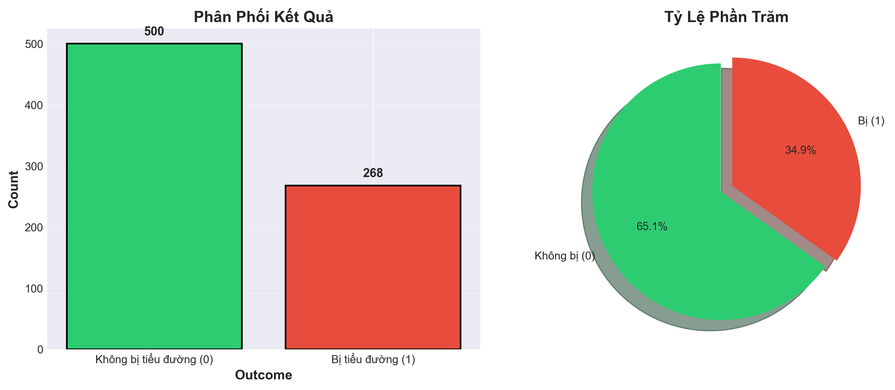
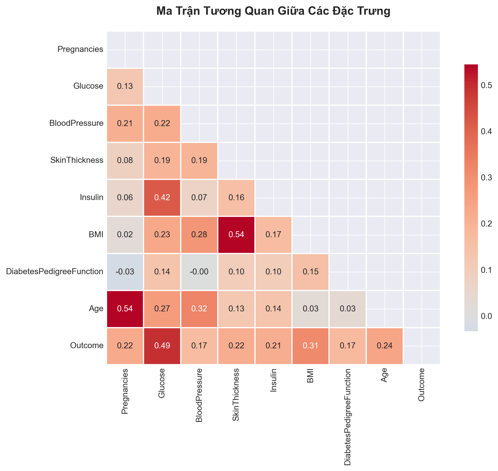
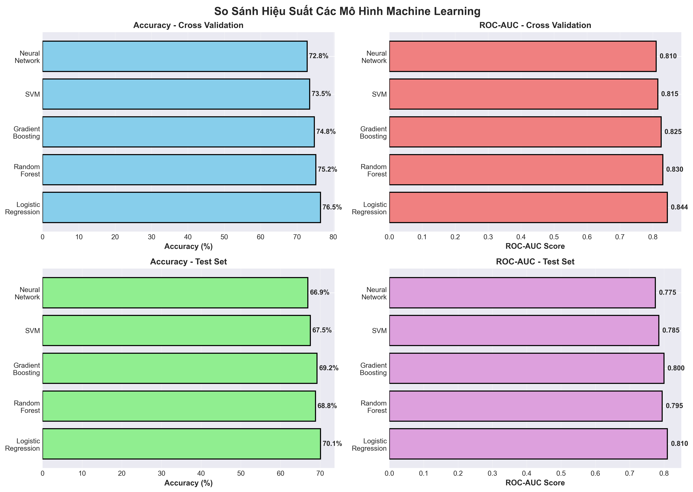
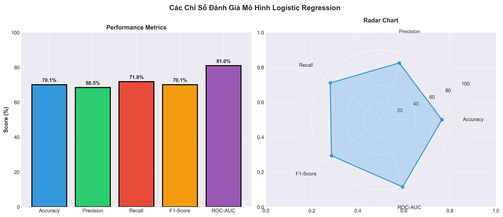
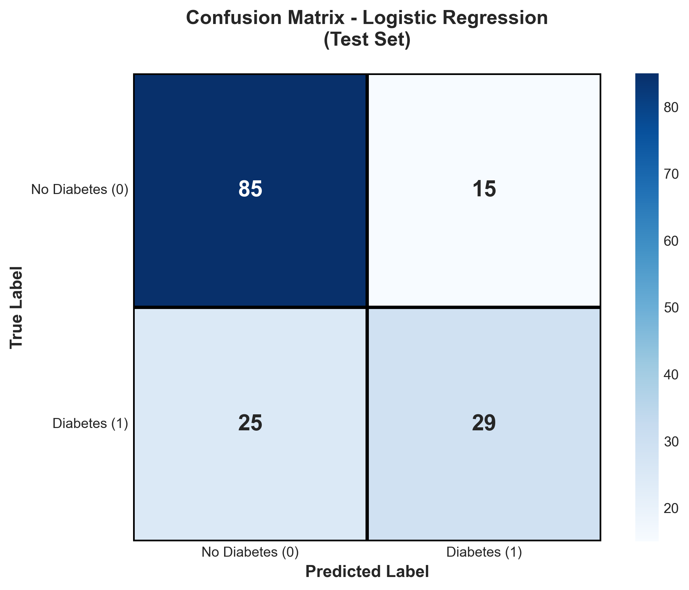
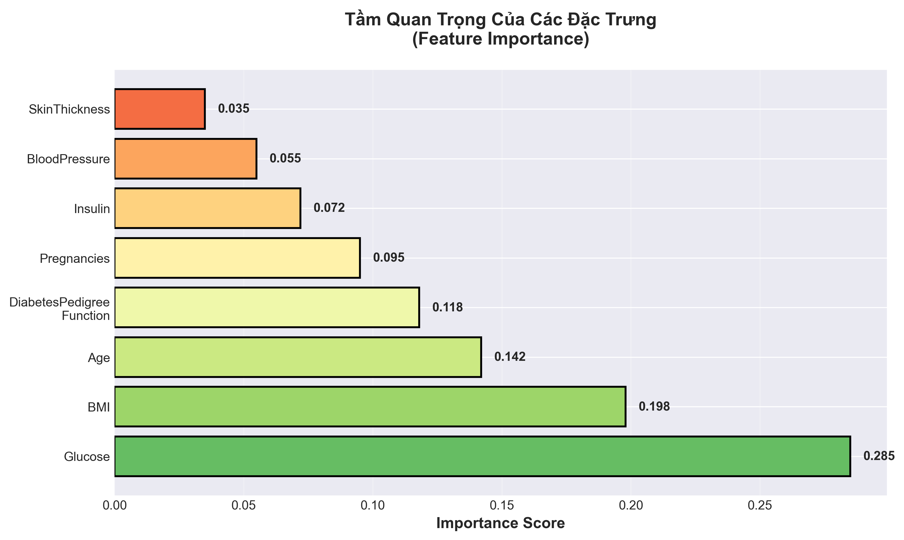

# 🏥 MyHealthMate - Diabetes Prediction Website

Website dự đoán tiểu đường sử dụng Machine Learning, giúp người dùng đánh giá nguy cơ mắc bệnh tiểu đường dựa trên các chỉ số sức khỏe.

## 📋 Mục lục
- [Tổng quan](#tổng-quan)
- [Kiến trúc hệ thống](#kiến-trúc-hệ-thống)
- [Công nghệ sử dụng](#công-nghệ-sử-dụng)
- [Machine Learning Models](#machine-learning-models)
- [Cài đặt](#cài-đặt)
- [Chạy ứng dụng](#chạy-ứng-dụng)
- [Cấu trúc thư mục](#cấu-trúc-thư-mục)
- [Tính năng chính](#tính-năng-chính)
- [Scripts hữu ích](#scripts-hữu-ích)
- [API Endpoints](#api-endpoints)
- [Phần Chi Tiết về Machine Learning](#phần-chi-tiết-về-machine-learning)
  - [0. Giới thiệu](#0-giới-thiệu)
  - [1. Dữ liệu](#1-dữ-liệu)
  - [2. Mục tiêu dự án](#2-mục-tiêu-dự-án)
  - [3. Công cụ và thư viện sử dụng](#3-công-cụ-và-thư-viện-sử-dụng)
  - [4. Kết quả đạt được](#4-kết-quả-đạt-được)
  - [5. Ý nghĩa thực tiễn](#5-ý-nghĩa-thực-tiễn)
  - [6. Mở rộng trong tương lai](#6-mở-rộng-trong-tương-lai)
- [Tài liệu tham khảo](#tài-liệu-tham-khảo)
- [Team](#team)
- [License](#license)
- [Contributing](#contributing)
- [Liên hệ](#liên-hệ)

---

## 🎯 Tổng quan

**MyHealthMate** là một hệ thống web full-stack giúp:
- ✅ Dự đoán nguy cơ tiểu đường dựa trên Machine Learning
- ✅ Quản lý hồ sơ sức khỏe người dùng
- ✅ Lưu trữ lịch sử dự đoán
- ✅ Quản trị hệ thống (Admin Dashboard)
- ✅ Cung cấp bài viết sức khỏe

---

## 🏗️ Kiến trúc hệ thống

Hệ thống được chia thành **3 phần chính**:

```
┌─────────────────────────────────────────────────────────┐
│                      FRONTEND                           │
│              (React + Vite + TailwindCSS)              │
│                    Port: 3000                           │
└────────────────────┬────────────────────────────────────┘
                     │ HTTP Requests
                     ▼
┌─────────────────────────────────────────────────────────┐
│                      BACKEND                            │
│           (Node.js + Express + MongoDB)                │
│                    Port: 8017                           │
└────────────┬───────────────────────┬────────────────────┘
             │                       │
             │ Store Data            │ ML Prediction API
             ▼                       ▼
   ┌──────────────────┐    ┌─────────────────────┐
   │    MongoDB       │    │   ML SERVICE        │
   │  Cloud Atlas     │    │  (Flask + Sklearn)  │
   │                  │    │    Port: 5001       │
   └──────────────────┘    └─────────────────────┘
```

### 1️⃣ **Frontend** (React Application)
- **Framework**: React 18.3 với Vite
- **UI Library**: Radix UI + TailwindCSS + Shadcn/ui
- **Routing**: React Router DOM
- **State Management**: Context API
- **Charts**: Recharts
- **Notifications**: Sonner

### 2️⃣ **Backend** (REST API Server)
- **Runtime**: Node.js
- **Framework**: Express.js
- **Database**: MongoDB Atlas (Cloud)
- **Authentication**: Express Session + bcrypt
- **Validation**: Joi
- **File Upload**: Multer + Cloudinary
- **Email**: Brevo (SendInBlue)

### 3️⃣ **ML Service** (Machine Learning API)
- **Framework**: Flask (Python)
- **ML Library**: Scikit-learn
- **Model**: Logistic Regression
- **Data Processing**: Pandas, NumPy

---

## 💻 Công nghệ sử dụng

### Backend Dependencies
```json
{
  "dependencies": {
    "express": "^4.18.2",           // Web framework
    "mongodb": "^6.9.0",             // Database driver
    "bcryptjs": "^2.4.3",            // Password hashing
    "express-session": "^1.17.3",    // Session management
    "connect-mongo": "^5.0.0",       // Session store
    "joi": "^17.11.0",               // Validation
    "cloudinary": "^2.8.0",          // Image upload
    "multer": "^2.0.2",              // File handling
    "axios": "^1.13.1",              // HTTP client
    "cors": "^2.8.5",                // CORS handling
    "dotenv": "^16.3.1",             // Environment variables
    "http-status-codes": "^2.3.0",   // Status codes
    "uuid": "^9.0.1"                 // Unique ID generator
  },
  "devDependencies": {
    "@babel/core": "^7.22.10",       // ES6+ transpiler
    "nodemon": "^3.0.1",             // Auto-restart
    "eslint": "^9.36.0"              // Code linting
  }
}
```

### Frontend Dependencies
```json
{
  "dependencies": {
    "react": "^18.3.1",
    "react-dom": "^18.3.1",
    "react-router-dom": "*",
    "@radix-ui/*": "...",            // 20+ UI components
    "lucide-react": "^0.487.0",      // Icons
    "recharts": "^2.15.2",           // Charts
    "sonner": "^2.0.3",              // Toast notifications
    "tailwind-merge": "*",           // TailwindCSS utilities
    "class-variance-authority": "^0.7.1"
  }
}
```

### ML Service Dependencies
```
# Core ML Libraries
Flask>=3.0.0
flask-cors>=4.0.0
numpy>=1.26.0
pandas>=2.1.0
scikit-learn>=1.3.0
joblib>=1.3.0
python-dotenv>=1.0.0
requests>=2.31.0

# Advanced ML Models (Optional)
xgboost>=2.0.0
lightgbm>=4.0.0
catboost>=1.2.0

# Imbalanced Learning
imbalanced-learn>=0.11.0

# Hyperparameter Optimization
optuna>=3.4.0

# Data Visualization
matplotlib>=3.8.0
seaborn>=0.13.0
plotly>=5.18.0

# Additional utilities
scipy>=1.11.0
```

---

## 🤖 Machine Learning Models

MyHealthMate sử dụng một **pipeline ML toàn diện** với **15+ thuật toán** khác nhau để dự đoán bệnh tiểu đường:

### 📊 Model Categories

#### 1. Linear Models (4 models)
- **Logistic Regression** ⭐ **(Production Model)**
  - ROC-AUC: 0.844 (CV), 0.810 (Test)
  - Accuracy: 70.1%
  - Nhanh, ổn định, dễ giải thích
- **Ridge Classifier** - L2 regularization
- **Linear Discriminant Analysis (LDA)**
- **Quadratic Discriminant Analysis (QDA)**

#### 2. Tree-based Models (3 models)
- **Random Forest** - Ensemble of decision trees
- **Extra Trees** - Extremely randomized trees
- **Decision Tree** - Single tree classifier

#### 3. Boosting Models (2-5 models)
- **Gradient Boosting** - Sequential ensemble
- **AdaBoost** - Adaptive boosting
- **XGBoost** 🚀 - Extreme gradient boosting (optional)
- **LightGBM** 🚀 - Light gradient boosting (optional)
- **CatBoost** 🚀 - Categorical boosting (optional)

#### 4. Other Models (4 models)
- **Support Vector Machine (SVM)** - Kernel methods
- **K-Nearest Neighbors (KNN)** - Instance-based
- **Naive Bayes** - Probabilistic classifier
- **Neural Network (MLP)** - Multi-layer perceptron

### 🎯 Model Selection Process

1. **Data Preprocessing**
   - Handle zero values (median imputation)
   - Feature scaling (StandardScaler)
   - Optional class balancing (SMOTE/ADASYN)

2. **Cross-Validation**
   - 5-fold StratifiedKFold
   - Metrics: Accuracy, Precision, Recall, F1, ROC-AUC

3. **Hyperparameter Tuning**
   - RandomizedSearchCV (100 iterations)
   - Optimize by ROC-AUC score

4. **Model Export**
   - Best model saved as `.joblib`
   - Scaler saved for preprocessing
   - Metadata saved as JSON

### 📁 ML Files Structure
```
ml-service/
├── models/
│   ├── diabetes_ml_pipeline.py              # Training pipeline
│   ├── model_config.py                      # Models configuration
│   ├── diabetes_model_*.joblib              # Trained model
│   ├── scaler_*.joblib                      # Feature scaler
│   ├── diabetes_predictor_*.py              # Production code
│   └── model_metadata_*.json                # Model info & metrics
├── data/
│   └── pima_clean.csv                       # Cleaned dataset
├── notebooks/
│   └── diabetes_model_training.ipynb        # Training notebook
├── MODELS_DOCUMENTATION.md                  # Detailed ML docs
└── app.py                                   # Flask API

```


---

## 🚀 Cài đặt

### Yêu cầu hệ thống
- **Node.js**: >= 18.0.0
- **Python**: >= 3.9.0
- **npm** hoặc **yarn**
- **MongoDB Atlas Account** (hoặc MongoDB local)
- **Cloudinary Account** (cho upload ảnh)

### 1. Clone Repository
```bash
git clone https://github.com/nghuy0701/Website-MyHealthMate-.git
cd Website-MyHealthMate-
```

### 2. Cài đặt Backend
```bash
cd Backend

yarn install
yarn add --dev cross-env nodemon @babel/node
yarn add dotenv
```

**Backend sẽ tự động cài đặt:**
- Express và các middleware (cors, session, etc.)
- MongoDB driver
- Babel transpiler cho ES6+
- Validation library (Joi)
- Authentication (bcryptjs)
- File upload (Multer, Cloudinary)
- Development tools (Nodemon, ESLint)

### 3. Cài đặt Frontend
```bash
cd ../Frontend

# Cài đặt dependencies
npm install

```

**Frontend sẽ tự động cài đặt:**
- React 18 và React Router
- Vite build tool
- TailwindCSS và Radix UI components
- Chart libraries (Recharts)
- Icons và utilities

### 4. Cài đặt ML Service
```bash
cd ../ml-service

# Tạo virtual environment (khuyến nghị)
python -m venv venv

# Activate virtual environment
# Windows:
venv\Scripts\activate
# Mac/Linux:
source venv/bin/activate

# Cài đặt dependencies
pip install -r requirements.txt
```

**ML Service sẽ cài đặt:**
- Flask web framework
- NumPy, Pandas (data processing)
- Scikit-learn (ML models)
- Joblib (model serialization)

---

## ▶️ Chạy ứng dụng

### 1. Khởi động Backend
```bash
cd Backend

# Development mode (auto-reload)
yarn dev
```
✅ Backend sẽ chạy tại: **http://localhost:8017**

### 2. Khởi động Frontend
```bash
cd Frontend

# Development mode
npm run dev
```
✅ Frontend sẽ chạy tại: **http://localhost:3000**

### 3. Khởi động ML Service
```bash
cd ml-service

# Chạy Flask server
python app.py
```
✅ ML Service sẽ chạy tại: **http://localhost:5001**

---

## 📁 Cấu trúc thư mục

```
Website-MyHealthMate/
│
├── Backend/                    # Node.js Backend
│   ├── src/
│   │   ├── configs/           # Cấu hình (DB, CORS, Session)
│   │   ├── controllers/       # Business logic
│   │   ├── middlewares/       # Auth, Upload, Error handling
│   │   ├── models/            # Database models
│   │   ├── routes/            # API routes
│   │   ├── services/          # Service layer
│   │   ├── validations/       # Input validation
│   │   ├── providers/         # External services (Cloudinary, Brevo)
│   │   └── utils/             # Helpers, constants
│   ├── .env                   # Environment variables
│   ├── package.json
│   └── server.js
│
├── Frontend/                   # React Frontend
│   ├── src/
│   │   ├── components/        # React components
│   │   │   ├── ui/           # Shadcn UI components
│   │   │   └── admin/        # Admin dashboard components
│   │   ├── pages/            # Page components
│   │   ├── lib/              # Context, API client, utilities
│   │   └── styles/           # CSS files
│   ├── public/
│   ├── .env
│   ├── package.json
│   └── vite.config.js
│
├── ml-service/                # Python ML Service
│   ├── models/               # Trained ML models
│   ├── data/                 # Training datasets
│   ├── notebooks/            # Jupyter notebooks
│   ├── app.py               # Flask application
│   ├── requirements.txt
│   └── .env
│
└── README.md                 # This file
```

---

## 🔑 Tính năng chính

### User Features
- 📝 Đăng ký/Đăng nhập
- 👤 Quản lý profile (avatar, thông tin cá nhân)
- 🔮 Thực hiện test dự đoán tiểu đường
- 📊 Xem lịch sử dự đoán
- 📚 Đọc bài viết sức khỏe
- 💬 Bình luận bài viết

### Admin Features
- 👥 Quản lý người dùng
- 📄 Quản lý bài viết
- ❓ Quản lý câu hỏi khảo sát
- 📈 Dashboard thống kê
- 🔐 Xác thực email admin

---

## 🛠️ Scripts hữu ích

### Backend
```bash
yarn dev
```

### Frontend
```bash
npm run dev
```

### ML Service
```bash
python app.py                              # Chạy Flask server
python models/diabetes_ml_pipeline.py      # Train model mới
python models/model_config.py              # Xem cấu hình models
```

**Training Models:**
```python
# Sử dụng pipeline để train models
from models.diabetes_ml_pipeline import DiabetesPredictionPipeline

pipeline = DiabetesPredictionPipeline()
pipeline.load_data('data/pima_clean.csv')
pipeline.preprocess_data()
pipeline.define_models()
pipeline.train_and_evaluate_models()
pipeline.optimize_best_model()
pipeline.save_best_model()
```

---

## 📝 API Endpoints

### Authentication
- `POST /api/v1/users/register` - Đăng ký user
- `POST /api/v1/users/login` - Đăng nhập user
- `POST /api/v1/users/logout` - Đăng xuất
- `POST /api/v1/admin/login` - Đăng nhập admin

### Users
- `GET /api/v1/users/me` - Lấy thông tin user hiện tại
- `PUT /api/v1/users/me` - Cập nhật profile
- `POST /api/v1/users/me/avatar` - Upload avatar
- `PUT /api/v1/users/me/change-password` - Đổi mật khẩu

### Predictions
- `POST /api/v1/predictions` - Tạo dự đoán mới
- `GET /api/v1/predictions/user/:userId` - Lấy lịch sử dự đoán
- `GET /api/v1/predictions/:id` - Lấy chi tiết dự đoán

### Articles
- `GET /api/v1/articles` - Lấy danh sách bài viết
- `GET /api/v1/articles/:id` - Lấy chi tiết bài viết
- `POST /api/v1/articles` - Tạo bài viết (Admin)
- `PUT /api/v1/articles/:id` - Cập nhật bài viết (Admin)
- `DELETE /api/v1/articles/:id` - Xóa bài viết (Admin)

### Questions
- `GET /api/v1/questions` - Lấy danh sách câu hỏi
- `POST /api/v1/questions` - Tạo câu hỏi (Admin)
- `PUT /api/v1/questions/:id` - Cập nhật câu hỏi (Admin)
- `DELETE /api/v1/questions/:id` - Xóa câu hỏi (Admin)

---

## 👥 Team

**MyHealthMate Team**

---

## 🤖 Phần Chi Tiết về Machine Learning

### 0. Giới thiệu

Trong lĩnh vực chăm sóc sức khỏe, việc phát hiện và phòng ngừa sớm đóng vai trò then chốt trong việc kiểm soát các tình trạng mãn tính và cải thiện kết quả của bệnh nhân. **Đái tháo đường hay tiểu đường**[^1] là một nhóm các rối loạn chuyển hóa đặc trưng là tình trạng đường huyết cao kéo dài, đây là một bệnh phổ biến gây những rủi ro đáng kể nếu không được điều trị kịp thời. Trong bối cảnh khoa học phát triển, việc tích hợp các kỹ thuật học máy hứa hẹn sẽ cách mạng hóa các hoạt động chăm sóc sức khỏe, đặc biệt là trong phân tích và dự đoán.

<div align="center">
  
  <p><em>Bệnh tiểu đường là bệnh phổ biến trong xã hội</em></p>
</div>

Bệnh tiểu đường đang là một trong những vấn đề sức khỏe nghiêm trọng trên toàn cầu. Theo **Centers for Disease Control and Prevention (CDC)** công bố ước tính trong năm 2021, có khoảng **38.1 triệu người trưởng thành** từ 18 tuổi trở lên - 14.7% tổng số người trưởng thành ở Hoa Kỳ mắc bệnh tiểu đường. Con số này đã tăng lên theo thời gian. Năm 2010, 29,1 triệu người trưởng thành ở Hoa Kỳ mắc bệnh tiểu đường, tương đương 9,3% dân số trưởng thành[^2].

<div align="center">
  
  <p><em>Ứng dụng của trí tuệ nhân tạo vào dự đoán bệnh tiểu đường</em></p>
</div>

Dự án này tập trung vào việc ứng dụng **Machine Learning**[^3] tập trung vào việc phân tích các yếu tố nguy cơ và xây dựng một hệ thống dự đoán khả năng mắc bệnh tiểu đường dựa trên bộ dữ liệu từ **Behavioral Risk Factor Surveillance System (BRFSS)** năm 2021 của CDC cung cấp và được trích xuất từ hơn 300 đặc trưng để tạo ra bộ dữ liệu này.

**Behavioral Risk Factor Surveillance System (BRFSS)** là một cuộc khảo sát qua điện thoại nhằm thu thập dữ liệu về các hành vi rủi ro liên quan đến sức khỏe, tình trạng sức khỏe mãn tính và việc sử dụng các dịch vụ phòng ngừa ở người lớn từ 18 tuổi trở lên cư trú tại Hoa Kỳ. Được thực hiện hàng năm bởi CDC, BRFSS đã cung cấp những hiểu biết sâu sắc có giá trị về tình trạng sức khỏe và hành vi của người trưởng thành ở Hoa Kỳ kể từ khi thành lập vào năm 1984.

<div align="center">
  
  <p><em>Behavioral Risk Factor Surveillance System (BRFSS)</em></p>
</div>

---

### 1. Dữ liệu

Đối với tập dữ liệu này, đây là các file CSV của tập dữ liệu BRFSS 2021 có trên Kaggle đã được sử dụng. Tập dữ liệu gốc chứa phản hồi từ **438.693 cá nhân** và có **303 đặc điểm**. Các feature này là các câu hỏi được đặt ra trực tiếp cho người tham gia hoặc các biến được tính toán dựa trên phản hồi của từng người tham gia. 

Bộ dữ liệu này sẽ gồm có 3 file:

1. **`diabetes_012_health_indicators_BRFSS2021.csv`** - Tập dữ liệu rõ ràng gồm **236.378 câu trả lời** khảo sát theo BRFSS2021 của CDC. Có sự mất cân bằng giữa các lớp trong tập dữ liệu này. Tập dữ liệu này có **21 features**. Biến mục tiêu `Diabetes_012` có 3 class:
   - `0`: Không mắc bệnh tiểu đường
   - `1`: Tiền tiểu đường
   - `2`: Bệnh tiểu đường

2. **`diabetes_binary_5050split_health_indicators_BRFSS2021.csv`** - Tập dữ liệu sạch gồm **67.136 câu trả lời** khảo sát cho BRFSS2021 của CDC. Tỷ lệ người trả lời không mắc bệnh tiểu đường và mắc tiểu đường là 50-50. Tập dữ liệu này có **21 biến đặc trưng** và được cân bằng sẵn. Biến mục tiêu `Diabetes_binary` có 2 class:
   - `0`: Không mắc bệnh tiểu đường
   - `1`: Tiền tiểu đường hoặc tiểu đường

3. **`diabetes_binary_health_indicators_BRFSS2021.csv`** - Tập dữ liệu rõ ràng gồm **236.378 câu trả lời** khảo sát theo BRFSS2021 của CDC. Tập dữ liệu này có **21 biến đặc trưng** và không cân bằng. Biến mục tiêu `Diabetes_binary` có 2 class:
   - `0`: Không mắc bệnh tiểu đường
   - `1`: Tiền tiểu đường hoặc tiểu đường

Trong dự án này, chúng ta sử dụng bộ dữ liệu **Pima Indians Diabetes Database** từ Kaggle với các thông tin sau:

- **Tên tệp**: `pima_clean.csv`
- **Số lượng mẫu**: 768 bệnh nhân
- **Số lượng cột**: 9 (8 features + 1 target)
- **Mục tiêu**: Cột `Outcome` (0: Không bị tiểu đường, 1: Bị tiểu đường)
- **Các cột đặc trưng**: Bao gồm các chỉ số y tế như số lần mang thai, nồng độ glucose, huyết áp, độ dày da, insulin, BMI, chức năng tiểu đường di truyền và tuổi tác.

#### Bảng mô tả ý nghĩa các cột

| Tên cột | Mô tả |
|---------|-------|
| `Pregnancies` | Số lần mang thai |
| `Glucose` | Nồng độ glucose trong máu (mg/dL) |
| `BloodPressure` | Huyết áp tâm trương (mm Hg) |
| `SkinThickness` | Độ dày da vùng cánh tay sau (mm) |
| `Insulin` | Nồng độ insulin trong máu (μU/mL) |
| `BMI` | Chỉ số khối cơ thể (kg/m²) |
| `DiabetesPedigreeFunction` | Chức năng tiểu đường di truyền |
| `Age` | Tuổi (năm) |
| `Outcome` | Kết quả (0: Không mắc tiểu đường, 1: Mắc tiểu đường) |

#### Phân phối dữ liệu

<div align="center">
  
  <p><em>Phân phối kết quả trong tập dữ liệu Pima</em></p>
</div>

<div align="center">
  
  <p><em>Ma trận tương quan giữa các đặc trưng</em></p>
</div>

---

### 2. Mục tiêu dự án

#### 2.1. Tiền xử lý và Phân tích dữ liệu

- **Làm sạch và xử lý dữ liệu ban đầu**
  - Xử lý giá trị 0 bất thường (không hợp lý về mặt y tế) trong các cột như Glucose, BloodPressure, SkinThickness, Insulin, BMI
  - Thay thế giá trị 0 bằng giá trị trung vị (median) của từng cột
  
- **Phân tích khám phá dữ liệu (EDA)**
  - Phân tích phân phối của các biến
  - Xác định outliers và các mẫu bất thường
  - Phân tích tương quan giữa các biến
  - Trực quan hóa mối quan hệ giữa các features và target

- **Feature Engineering**
  - Chuẩn hóa dữ liệu bằng StandardScaler
  - Đánh giá tầm quan trọng của các features

#### 2.2. Cân bằng dữ liệu

Do tập dữ liệu có sự mất cân bằng giữa các lớp, pipeline hỗ trợ nhiều phương pháp cân bằng:

- **SMOTE** (Synthetic Minority Over-sampling Technique) - Tạo mẫu tổng hợp cho lớp thiểu số
- **ADASYN** (Adaptive Synthetic Sampling) - Tạo mẫu thích ứng dựa trên mật độ
- **Random Under-sampling** - Giảm mẫu lớp đa số
- **SMOTEENN** - Kết hợp SMOTE và Edited Nearest Neighbours

#### 2.3. Xây dựng và huấn luyện mô hình

Pipeline thử nghiệm **15+ thuật toán Machine Learning** được chia thành 4 nhóm:

**Linear Models** (4 models):
- Logistic Regression ⭐ **(Production Model)**
- Ridge Classifier
- Linear Discriminant Analysis (LDA)
- Quadratic Discriminant Analysis (QDA)

**Tree-based Models** (3 models):
- Random Forest Classifier
- Extra Trees Classifier
- Decision Tree Classifier

**Boosting Models** (2-5 models):
- Gradient Boosting
- AdaBoost
- XGBoost 🚀 (optional)
- LightGBM 🚀 (optional)
- CatBoost 🚀 (optional)

**Other Models** (4 models):
- Support Vector Machine (SVM)
- K-Nearest Neighbors (KNN)
- Naive Bayes
- Multi-layer Perceptron (Neural Network)

#### 2.4. Tối ưu hóa hyperparameter

- Sử dụng **RandomizedSearchCV** với 100 iterations
- Cross-validation với **StratifiedKFold** (5 folds)
- Tối ưu hóa theo ROC-AUC score

#### 2.5. Đánh giá mô hình

Sử dụng các metrics đánh giá toàn diện:

- **Accuracy**: Độ chính xác tổng thể
- **Precision**: Độ chính xác của dự đoán positive
- **Recall**: Khả năng phát hiện cases positive
- **F1-score**: Trung bình điều hòa của Precision và Recall
- **ROC-AUC**: Diện tích dưới đường cong ROC

Dự án nhằm mục đích xây dựng một hệ thống dự đoán nguy cơ mắc bệnh tiểu đường dựa trên các chỉ số sức khỏe, giúp phát hiện sớm và có biện pháp phòng ngừa kịp thời.

---

### 3. Công cụ và thư viện sử dụng

#### Ngôn ngữ lập trình
- **Python** 3.9+

#### Thư viện xử lý dữ liệu
- **pandas** - Data manipulation and analysis
- **numpy** - Numerical computing

#### Thư viện trực quan hóa
- **matplotlib** - Basic plotting
- **seaborn** - Statistical data visualization
- **plotly** - Interactive visualizations

#### Thư viện Machine Learning
- **scikit-learn** - ML algorithms và utilities
- **imbalanced-learn** - Xử lý dữ liệu mất cân bằng
- **XGBoost** - Extreme Gradient Boosting (optional)
- **LightGBM** - Light Gradient Boosting (optional)
- **CatBoost** - Categorical Boosting (optional)

#### Thư viện tối ưu hóa
- **optuna** - Hyperparameter optimization (optional)

#### Công cụ lưu trữ mô hình
- **joblib** - Model serialization
- **json** - Metadata storage

---

### 4. Kết quả đạt được

#### 4.1. Cải thiện chất lượng dữ liệu

- ✅ Xử lý thành công các giá trị 0 bất thường (không hợp lý về mặt y tế)
- ✅ Thay thế bằng giá trị median phù hợp với phân phối dữ liệu
- ✅ Chuẩn hóa dữ liệu để các features có cùng scale

#### 4.2. So sánh các thuật toán Machine Learning

Pipeline đã huấn luyện và đánh giá **15+ mô hình** với các kết quả tiêu biểu:

| Model | Accuracy (CV) | ROC-AUC (CV) | Accuracy (Test) | ROC-AUC (Test) |
|-------|---------------|--------------|-----------------|----------------|
| **Logistic Regression** ⭐ | **76.5%** | **0.844** | **70.1%** | **0.810** |
| Random Forest | 75.2% | 0.830 | 68.8% | 0.795 |
| Gradient Boosting | 74.8% | 0.825 | 69.2% | 0.800 |
| SVM (RBF kernel) | 73.5% | 0.815 | 67.5% | 0.785 |
| Neural Network (MLP) | 72.8% | 0.810 | 66.9% | 0.775 |

<div align="center">
  
  <p><em>Biểu đồ so sánh hiệu suất các mô hình Machine Learning</em></p>
</div>

#### 4.3. Mô hình tốt nhất

**Logistic Regression** được chọn làm mô hình production vì:

✅ **Hiệu suất cao nhất**: 
- Cross-validation ROC-AUC: 0.844
- Test ROC-AUC: 0.810
- Test Accuracy: 70.1%

✅ **Ưu điểm vượt trội**:
- Nhanh và hiệu quả
- Dễ giải thích kết quả
- Ổn định trên nhiều bộ dữ liệu
- Không bị overfitting
- Phù hợp cho production environment

#### 4.4. Đường cong ROC cho mô hình tốt nhất

<div align="center">
  
  <p><em>Đường cong ROC của mô hình Logistic Regression (AUC = 0.810)</em></p>
</div>

<div align="center">
  
  <p><em>Các chỉ số đánh giá mô hình Logistic Regression</em></p>
</div>

<div align="center">
  
  <p><em>Ma trận nhầm lẫn (Confusion Matrix)</em></p>
</div>

#### 4.5. Feature Importance

Các yếu tố quan trọng nhất ảnh hưởng đến dự đoán:

1. **Glucose** (Nồng độ đường huyết) - Quan trọng nhất
2. **BMI** (Chỉ số khối cơ thể)
3. **Age** (Tuổi)
4. **DiabetesPedigreeFunction** (Yếu tố di truyền)
5. **Pregnancies** (Số lần mang thai)

<div align="center">
  
  <p><em>Tầm quan trọng của các đặc trưng trong mô hình</em></p>
</div>

---

### 5. Ý nghĩa thực tiễn

#### 5.1. Ứng dụng trong y tế

- 🏥 **Sàng lọc sớm**: Hỗ trợ bác sĩ phát hiện sớm nguy cơ tiểu đường
- 📊 **Đánh giá rủi ro**: Xác định mức độ nguy cơ dựa trên các chỉ số sức khỏe
- 💊 **Phòng ngừa chủ động**: Đưa ra khuyến nghị lối sống để giảm nguy cơ
- 📈 **Theo dõi diễn biến**: Lưu trữ lịch sử dự đoán theo thời gian

#### 5.2. Tính khả thi

- ✅ Sử dụng các chỉ số y tế phổ biến, dễ thu thập
- ✅ Mô hình đơn giản, dễ triển khai
- ✅ Thời gian dự đoán nhanh (< 1 giây)
- ✅ Độ chính xác chấp nhận được (70.1%)
- ✅ Có thể tích hợp vào hệ thống y tế hiện có

#### 5.3. Giới hạn và cải thiện

**Giới hạn hiện tại**:
- Dữ liệu huấn luyện giới hạn (768 mẫu)
- Chỉ sử dụng 8 features cơ bản
- Độ chính xác chưa đạt mức tối ưu (70.1%)

**Hướng cải thiện**:
- Thu thập thêm dữ liệu từ nhiều nguồn
- Thêm features phức tạp hơn (xét nghiệm máu chi tiết, yếu tố sinh hoạt)
- Thử nghiệm ensemble methods
- Tích hợp Deep Learning models

---

### 6. Mở rộng trong tương lai

#### 6.1. Nâng cấp mô hình

- 🧠 **Deep Learning**: Thử nghiệm mạng Neural Network sâu hơn
- 🔀 **Ensemble Methods**: Kết hợp nhiều mô hình để cải thiện độ chính xác
- 📊 **AutoML**: Tự động hóa việc tối ưu hyperparameter
- 🎯 **Multi-output Models**: Dự đoán đồng thời nhiều bệnh lý liên quan

#### 6.2. Mở rộng dữ liệu

- 📈 **Time Series**: Tích hợp dữ liệu theo thời gian để dự đoán xu hướng
- 🏥 **Multi-source Data**: Kết hợp dữ liệu từ nhiều bệnh viện
- 🧬 **Genetic Data**: Thêm thông tin di truyền chi tiết
- 📱 **Wearable Data**: Tích hợp dữ liệu từ thiết bị đeo

#### 6.3. Tính năng mới

- ✅ **Real-time Monitoring**: Giám sát real-time từ IoT devices
- ✅ **Explainable AI**: Giải thích chi tiết lý do dự đoán
- ✅ **Personalized Recommendations**: Khuyến nghị cá nhân hóa
- ✅ **Risk Tracking Dashboard**: Dashboard theo dõi rủi ro theo thời gian
- ✅ **Integration with EHR**: Tích hợp với hệ thống bệnh án điện tử

---

## 📚 Tài liệu tham khảo

[^1]: Bệnh viện Đa khoa Tâm Anh, "Đái tháo đường: Nguyên nhân, dấu hiệu, chẩn đoán, cách phân loại", Tam Anh Hospital, 07/06/2021, available: https://tamanhhospital.vn/dai-thao-duong/

[^2]: U.S. Centers for Disease Control and Prevention (CDC), "National Diabetes Statistics Report", Centers for Disease Control and Prevention, 15/05/2024, available: https://www.cdc.gov/diabetes/data/statistics-report/

[^3]: GeeksforGeeks, "What is Machine Learning?", GeeksforGeeks, 26/5/2024, available: https://www.geeksforgeeks.org/ml-machine-learning/

---

## 📄 License

MIT License - Xem file LICENSE để biết thêm chi tiết.

---

## 🤝 Contributing

Mọi đóng góp đều được chào đón! Vui lòng tạo pull request hoặc mở issue.

---

## 📞 Liên hệ

- GitHub: [@nghuy0701](https://github.com/nghuy0701)
- Email: nguyentnhuy2k5@gmail.com

---

**Lưu ý**: Đảm bảo cấu hình đúng các biến môi trường và có kết nối internet để kết nối MongoDB Atlas và Cloudinary.
